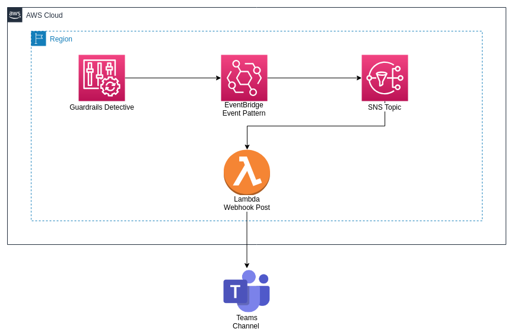

# Terraform AWS How to Detect a Guardrail Violation



This template has a terraform modules that provides the following resources:
- [IAM Roles](https://github.com/jslopes8/terraform-aws-iam-roles)
- [EventBrigde Rule](https://github.com/jslopes8/terraform-aws-cw-event-rules)
- [SNS Topic](https://github.com/jslopes8/terraform-aws-sns)
- [Lambda Function](https://github.com/jslopes8/terraform-aws-lamda.git)

## Directory tree structure
```bash
terraform-aws-guardrail-violation$ tree
.
├── lambda-code
│   └── lambda_function.py
├── img
│   └── DetectGuardrailViolation.png
├── cloud-config.tf
├── main.tf
└── README.md

2 directories, 5 files

```
### Understanding the structure of the template
`cloud-config.tf` - AWS credentials as well as setting the Terraform Backend S3.
`main.tf` - file with the main settings for the stack set, detail below.

The contents of the main file:
- `data-sources` - At runtime, get the current account id and region.
- `eventbridge_rule` - Creation of Rules, the event pattern that EventBrigde will receive, with the names of the configRules that will be monitored with the compliance policy.
`sns_topic` - Create an SNS Topic Endpoint for Lambda
`lambda_func` - Create a Lambda Function, with an environment variable for Teams Webhook to POST to a channel of your choice.

***A best-practice of using Terraform is not to put your access keys and secret in the configuration file. My recommendation is to use the configuration file to specify your credentials. The default location is "$HOME/.aws/credentials" on Linux and macOS or "%USERPROFILE%\.aws\credentials" on Windows. By setting the profile argument in the provider block, by default terraform will fetch this information from this configuration file with your credentials.***

## Usage
Terraform Module EventBridge Rule: List with the names of guard rails detective.
```bash
module "eventbridge_rule" {
  source  = "git::https://github.com/jslopes8/terraform-aws-cw-event-rules.git?ref=v1.1"

  name        = local.stack_name
  description = "${local.stack_name} Notification"

  event_pattern = jsonencode({
    "source": ["aws.config"],
    "detail-type": ["Config Rules Compliance Change"],
    "detail": {
      "messageType": ["ComplianceChangeNotification"],
      "configRuleName": [
        "AWSControlTower_AWS-GR_RESTRICTED_COMMON_PORTS",
        "AWSControlTower_AWS-GR_RESTRICTED_SSH",
        "AWSControlTower_AWS-GR_S3_BUCKET_PUBLIC_WRITE_PROHIBITED",
        "AWSControlTower_AWS-GR_S3_BUCKET_PUBLIC_READ_PROHIBITED",
        "AWSControlTower_AWS-GR_ROOT_ACCOUNT_MFA_ENABLED",
        "AWSControlTower_AWS-GR_ENCRYPTED_VOLUMES",
        "AWSControlTower_AWS-GR_RDS_STORAGE_ENCRYPTED",
        "AWSControlTower_AWS-GR_S3_VERSIONING_ENABLED",
        "AWSControlTower_AWS-GR_IAM_USER_MFA_ENABLED"
      ],
      "newEvaluationResult": {
        "complianceType": ["NON_COMPLIANT"]
      }
    }
  })

  targets = [
    {
      target_id  = "SendToSNS"
      arn = module.baseline_sns_topic.arn["ARN"]
    
      input_transformer = [{
        input_paths = {
          "aws_account":"$.account",
          "aws_regions":"$.region",
          "compliance_type":"$.detail.newEvaluationResult.complianceType",
          "resource_id":"$.detail.resourceId",
          "resource_type":"$.detail.resourceType",
          "rule_name":"$.detail.configRuleName",
          "time":"$.time"
        }
        input_template = "\"Notificação de Mudança de Conformidade na conta <aws_account> com o Config Rule <rule_name> na região de <aws_regions>. Para o recurso <resource_type> com o Id <resource_id>, resultando em <compliance_type>.\""
      }]
    }
  ]

  default_tags = local.default_tags
}
```
Terraform Module Lambda Function: WebHook POST to Teams Channel 
```bash
module "lambda_func" {
  source = "git::https://github.com/jslopes8/terraform-aws-lamda.git?ref=v0.1.0"

  function_name = local.stack_name
  description   = "${local.stack_name} NON-Compliance"

  handler = "lambda_function.lambda_handler"
  runtime = "python3.6"
  timeout = "3"
  role    = module.create_lambda_role.role_arn

  environment = {
    WebHookTeams = "https://exemple.webhook.office.com/webhookb2/92a06e6e-634a-........"
  }

  archive_file = [{
    type        = "zip"
    source_dir  = "lambda-code"
    output_path = "lambda-code/lambda_function.zip"
  }]

  lambda_permission   = [
    {
      statement_id  = "AllowExecutionFromCloudWatch"
      action        = "lambda:InvokeFunction"
      principal     = "events.amazonaws.com"
      source_arn    = module.baseline_eventbridge.cw_arn
    },
    {
      statement_id  = "AllowExecutionFromSNS"
      action        = "lambda:InvokeFunction"
      principal     = "sns.amazonaws.com"
      source_arn    = module.baseline_sns_topic.topic_arn
    }
  ]

  default_tags = local.default_tags
}
```

## Requirements
| Name | Version |
| ---- | ------- |
| aws | ~> 3.1 |
| terraform | ~> 0.14 |